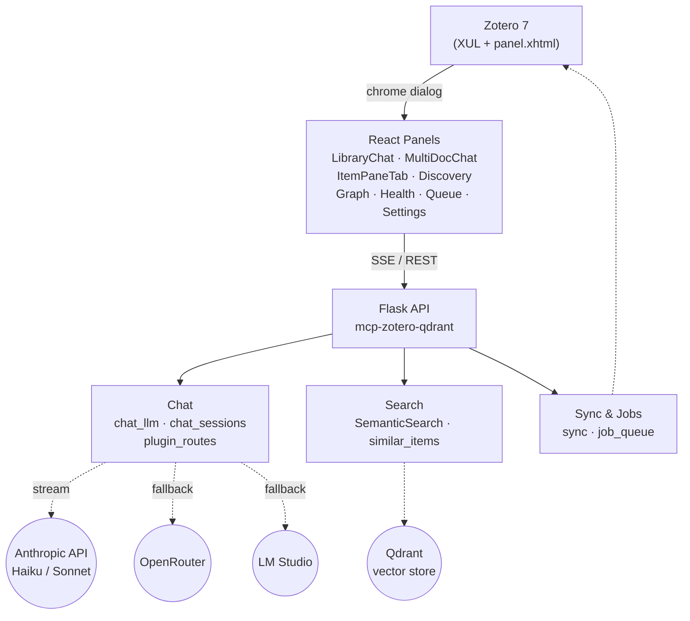

# Zotero AI Companion

AI research companion for Zotero 7 — chat with your library, discover connections, and manage your collection with LLM-powered tools.

## Architecture

## Panels

| Panel | Access | Description |
|-------|--------|-------------|
| Item Chat | Item pane → AI tab | Chat with a single document; history persists per item |
| Library Chat | Tools → Library Chat | Cross-library semantic search + LLM; session history sidebar |
| Multi-doc Chat | Right-click → Chat with documents | Chat across selected items; scope persists with session |
| Discovery | Tools → Discovery | Semantic discovery across the full library |
| Similarity Graph | Tools → Similarity Graph | Visual network of related items |
| Library Health | Tools → Library Health | Indexing coverage and metadata quality |
| Index Queue | Tools → Index Queue | Monitor background indexing jobs |
| Settings | Tools → AI Settings | Configure API URL, LLM provider, sync options |

## Requirements

- Zotero 7 (Firefox 102+)
- [mcp-zotero-qdrant](https://github.com/dsmoz/mcp-zotero-qdrant) Flask API running on `localhost:6500`
- At least one of: `ANTHROPIC_API_KEY`, `OPENROUTER_API_KEY`, or LM Studio running locally

## Version History

| Version | Date | Summary |
|---------|------|---------|
| 0.3.0 | 2026-03-28 | LLM chat (item/library/multi-doc), citations, context maintenance, related docs |
| 0.2.1 | 2026-03-28 | Restore CSS design tokens lost in rebase |
| 0.2.0 | 2026-03-28 | Fix window focus API (Services.wm.getEnumerator) |
| 0.1.8 | 2026-03-28 | Restore command handlers after rebase abort |
| 0.1.7 | 2026-03-28 | Initial Library Chat + Multi-doc Chat + SSE streaming |
